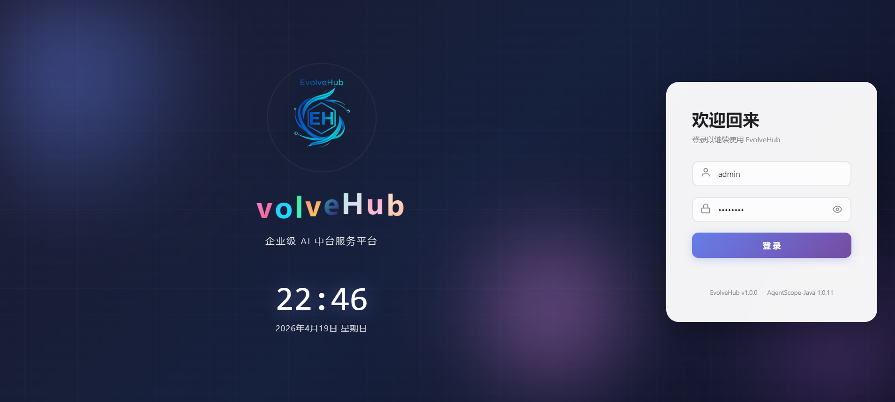
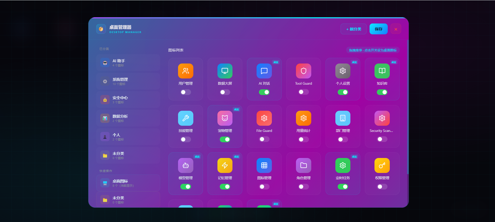
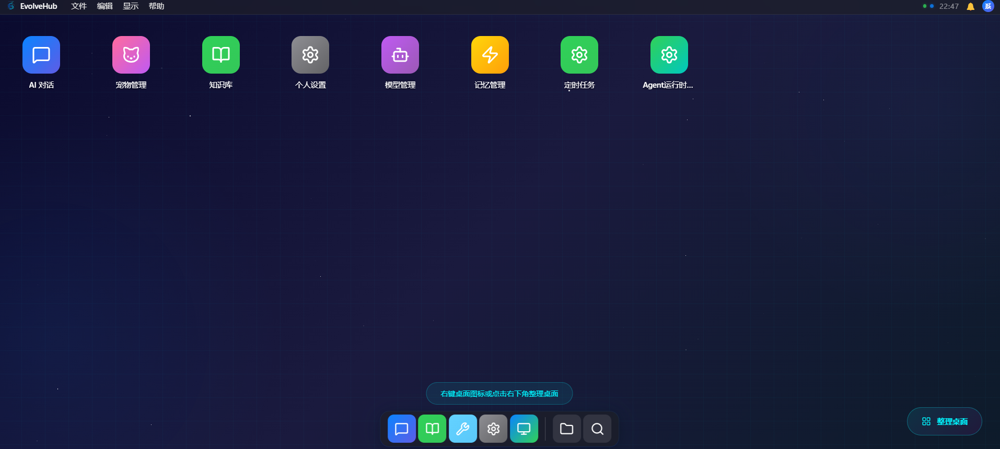
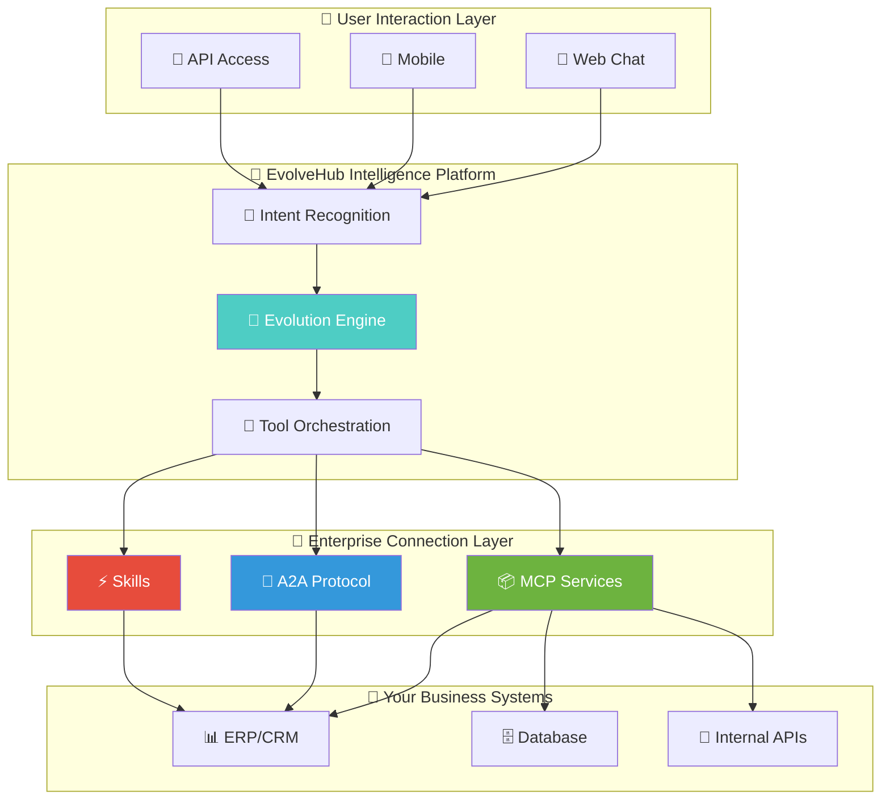

<div align="center">

<!-- Header Wave -->


<!-- Logo with Glow Effect -->
<picture>
  <source media="(prefers-color-scheme: dark)" srcset="docs/logo.svg">
  <source media="(prefers-color-scheme: light)" srcset="docs/logo.svg">
  
</picture>

<br/>

<!-- Animated Title -->
<h1>
  
</h1>

<!-- Subtitle -->
<p>
  
</p>

<!-- Tagline -->
<p>

```
╭───────────────────────────────────────────────────────────╮
│  ✦  Enterprise AI Platform  ✦  Zero-Code  ✦  Ready  ✦  │
╰───────────────────────────────────────────────────────────╯
```

**Enterprise AI Conversational Platform · Ready to Use · Zero Code**

</p>

<br/>

<!-- Stats Badges -->
<p>
  
  
  
</p>

<!-- Badge Wall -->
<p>
  
  
  
  
  
  
</p>

<p>
  <a href="README_zh.md">
    
  </a>
</p>

<!-- Footer Wave -->


</div>

---

<!-- ═══════════════════════════════════════════════════════════════════ -->
<!--                      SECTION DIVIDER                          -->
<!-- ═══════════════════════════════════════════════════════════════════ -->

 &nbsp; **What is EvolveHub?** &nbsp; 


<div align="center">

| 🧬 | **EvolveHub = Enterprise Claude** |
|:--:|:----------------------------------|

</div>

> **EvolveHub** is a ready-to-use enterprise AI platform. No coding required — simply connect your company's **MCP services** or **A2A protocol**, and AI can seamlessly interact with your business systems.

<br/>

<div align="center">

### 🪄 One Sentence Summary

```
╭═══════════════════════════════════════════════════════════╮
║                                                           ║
║   ⚡ Configure and use. Connect everything.              ║
║   🚀 Let AI understand and operate your enterprise.        ║
║                                                           ║
╰═══════════════════════════════════════════════════════════╯
```

**Configure and use. Connect everything. Let AI understand and operate your enterprise systems.**

</div>

---


 &nbsp; **Core Capabilities** &nbsp; 

<div align="center">

<table>
<tr>
<td width="50%" valign="top">

### 🔌 Plug & Play


```
╭────────────────────────────────────────╮
│  📦 Ready to Use                        │
│  🔗 MCP Protocol                       │
│  🤝 A2A Protocol                      │
│  ⚡ Skills Extension                   │
╰────────────────────────────────────────╯
```

- 📦 **Ready to Use** — No development needed, configure and go
- 🔗 **MCP Protocol** — Compatible with ModelScope MCP ecosystem
- 🤝 **A2A Protocol** — Multi-agent interconnection support
- ⚡ **Skills Extension** — One-click enterprise skill packages

```diff
+ Zero-code integration
+ Minutes-level deployment
+ Enterprise-grade security
```

</td>
<td width="50%" valign="top">

### 🧠 Intelligent Evolution


```
╭────────────────────────────────────────╮
│  🧬 Memory Evolution                   │
│  ⚡ Strategy Iteration                 │
│  🤝 Collaborative Emergence           │
│  📊 Knowledge Accumulation           │
╰────────────────────────────────────────╯
```

- 🧬 **Memory Evolution** — AI understands your business better over time
- ⚡ **Strategy Iteration** — Auto-optimizes conversation strategies
- 🤝 **Collaborative Emergence** — Multi-agent intelligent collaboration
- 📊 **Knowledge Accumulation** — Continuous enterprise knowledge building

```diff
+ Gets smarter with use
+ Deeper business understanding
+ More precise decisions
```

</td>
</tr>
</table>

</div>

---


 &nbsp; **Screenshots** &nbsp; 

<div align="center">

| Login | Desktop Management |
|:------:|:------------------:|
|  |  |

| Super Admin Backend |
|:-------------------:|
|  |

</div>

---


 &nbsp; **Platform Architecture** &nbsp; 

<div align="center">



</div>

---


 &nbsp; **Use Cases** &nbsp; 

<div align="center">

| 💬 Smart Customer Service | 📊 Data Assistant | 🔧 Ops Assistant | 📋 Workflow Approval | 🎓 Training Tutor |
|:------------------------:|:----------------:|:----------------:|:-------------------:|:----------------:|
| AI understands business, auto-queries orders, handles tickets | Natural language database queries, report generation | AI executes operations, auto-troubleshoots | Intelligent approval understanding, decision support | Q&A based on enterprise knowledge base |
| **80% efficiency boost** | **Zero SQL barrier** | **70% faster response** | **3x faster approval** | **60% lower cost** |

</div>

---


 &nbsp; **Integration Methods** &nbsp; 

### 🔹 Method 1: MCP Protocol

Simply configure your MCP service endpoint, platform auto-discovers and loads tools:

```yaml
# evolverhub-config.yaml
mcp:
  servers:
    - name: "company-erp"
      endpoint: "https://erp.company.com/mcp"
      auth:
        type: "bearer"
        token: "${ERP_API_TOKEN}"
```

### 🔹 Method 2: A2A Protocol

Register your Agent to A2A network for multi-agent collaboration:

```yaml
a2a:
  registry: "nacos://localhost:8848"
  agents:
    - name: "order-agent"
      capability: "Order Query & Processing"
    - name: "inventory-agent"
      capability: "Inventory Management"
```

### 🔹 Method 3: Skills Packages

Import pre-built enterprise skill packages for instant business capabilities:

```yaml
skills:
  - name: "database-query"
    version: "1.0.0"
  - name: "report-generator"
    version: "2.1.0"
```

---


 &nbsp; **Personal AI vs Enterprise** &nbsp; 

<div align="center">

| Dimension | Personal AI Assistant | **EvolveHub Enterprise** |
|:---------:|:--------------------:|:------------------------:|
| 🎯 **Focus** | Personal productivity | Enterprise intelligence |
| 👥 **Use Case** | Solo conversations, document handling | Team collaboration, business system integration |
| 🔐 **Access Control** | Basic | 🟢 Full RBAC + Data permissions |
| 🏢 **Multi-tenancy** | Not supported | 🟢 Department/Project-level isolation |
| 🔌 **Enterprise Integration** | Chat only | 🟢 Seamless MCP/A2A integration |
| 📊 **Knowledge Base** | Personal documents | 🟢 Enterprise KB + Vector search |
| 🔒 **Data Security** | Local or cloud | 🟢 Private deployment, full control |
| 📈 **Audit & Compliance** | None | 🟢 Operation audit, permission tracking |
| 🚀 **Deployment** | Local install | 🟢 Docker/K8s one-click deploy |

</div>

> 💡 Personal AI assistants are great for individual productivity; EvolveHub is designed for enterprise management with **access control**, **multi-tenancy**, **business system integration**, and **compliance audit** capabilities, making AI the true **enterprise intelligence hub**.

---


 &nbsp; **Comparison with Traditional AI Development** &nbsp; 

<div align="center">

| Dimension | Traditional AI Development | **EvolveHub** |
|:---------:|:--------------------------:|:-------------:|
| Development Cost | 🔴 High (needs AI engineers) | 🟢 Zero-code config |
| Deployment Time | 🔴 Weeks/Months | 🟢 Minutes |
| Business Adaptation | 🔴 Custom development | 🟢 MCP/A2A plug-and-play |
| Knowledge Building | 🔴 Static Prompts | 🟢 Auto-evolution accumulation |
| Maintenance Cost | 🔴 Continuous investment | 🟢 Self-adaptive optimization |

</div>

---


 &nbsp; **Deployment Options** &nbsp; 

<div align="center">

| 🐳 Docker | ☸️ Kubernetes | 🏢 On-Premise |
|:---------:|:-------------:|:-------------:|
| Quick trial, test environments | Production, high availability | Data-sensitive, compliance |
| **One-click startup** | **Elastic scaling** | **Full control** |

</div>

### 🚀 Docker Quick Start

```bash
# Pull image
docker pull evolvehub/server:latest

# Start service
docker run -d \
  --name evolvehub \
  -p 8080:8080 \
  -v ./config:/app/config \
  evolvehub/server:latest

# Visit http://localhost:8080 to start using
# Default admin: admin / admin123
```

---


 &nbsp; **Default Account** &nbsp; 

<div align="center">

```
╭───────────────────────────────────────────╮
│  🏆  Super Admin                         │
│  ─────────────────────                   │
│  👤  admin                               │
│  🔑  admin123                           │
╰───────────────────────────────────────────╯
```

</div>

---


 &nbsp; **Star History** &nbsp; 

<div align="center">

[](https://star-history.com/#devnomad-byte/EvolveHub&Timeline)

</div>

---


 &nbsp; **Join the Community** &nbsp; 

<div align="center">

### 📱 Scan to Join DingTalk Group


*Product Inquiry · Technical Discussion · Feedback*

<br/>

### 👥 Contributors

[](https://github.com/devnomad-byte/EvolveHub/graphs/contributors)

<br/>

</div>

---


<div align="center">

[](https://opensource.org/licenses/MIT)

<br/>

```
╭───────────────────────────────────────────────────────────╮
│                                                           │
│        ✦ ✦ ✦  Made with ❤️ by EvolveHub Team  ✦ ✦ ✦    │
│                                                           │
╰───────────────────────────────────────────────────────────╯
```


</div>
